How to install my app
======================

  * 1. Step one to Install , First got to https://github.com/cindyxue/CMPE131_2019Fall_Team1
  * 2. Step two Clone or download the code

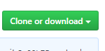
..

  * 3. Step three open code in an editor
  * 4. Step four pip install FLASK mail
  * 4.1 Step Four point one open requirment.txt and download list

  * 5. Step five go to  Shifterapp > open terminal
  * 6. Step six  in terminal flask run
  * 7. Alternative open app on https://shift-er.herokuapp.com/

How to navigate Shifter
=======================

 * Homepage

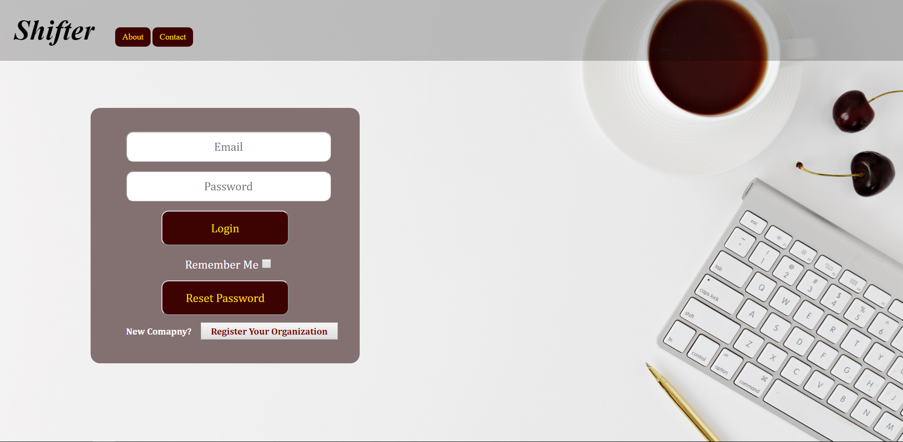
..

 * About Page

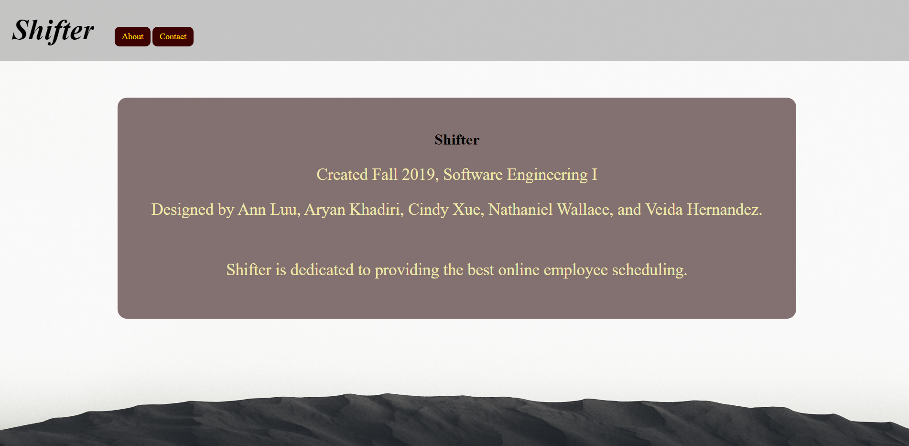
..

 * Contact

.. image:: image/Contact1.PNG
    :width: 400px
    :align: center
    :height: 200px
    :alt: alternate text
..

 * Contact/ Email sent confirmation message

.. image:: image/Contact2.PNG
    :width: 400px
    :align: center
    :height: 200px
    :alt: alternate text
..

 * Email recivied by cmpe131shifter@gmail.com

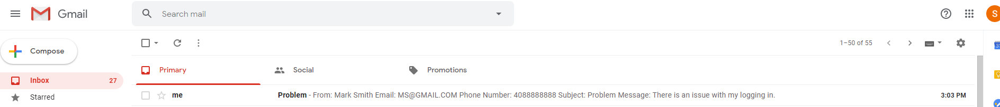
..

 * How information in email is displayed

.. image:: image/Contact4.PNG
    :width: 700px
    :align: center
    :height: 300px
    :alt: alternate text
..

 * Register New Organization

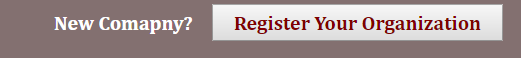
..

 * Register Organization Form

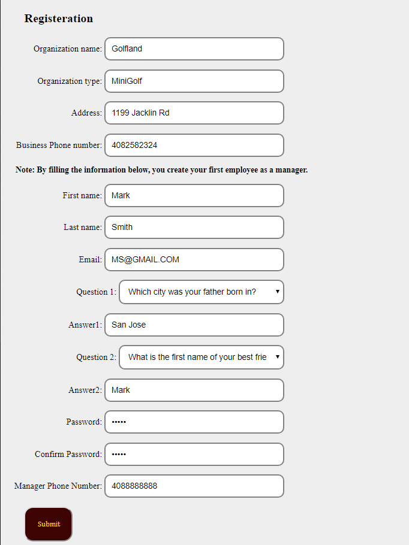
..

 * Register Confirmation

.. image:: image/RegisterConfirm.PNG
    :width: 400px
    :align: center
    :height: 400px
    :alt: alternate text
..

 * Loging Manager Mark Smith

.. image:: image/LoginMS.PNG
    :width: 400px
    :align: center
    :height: 400px
    :alt: alternate text
..

 * Manger Homepage

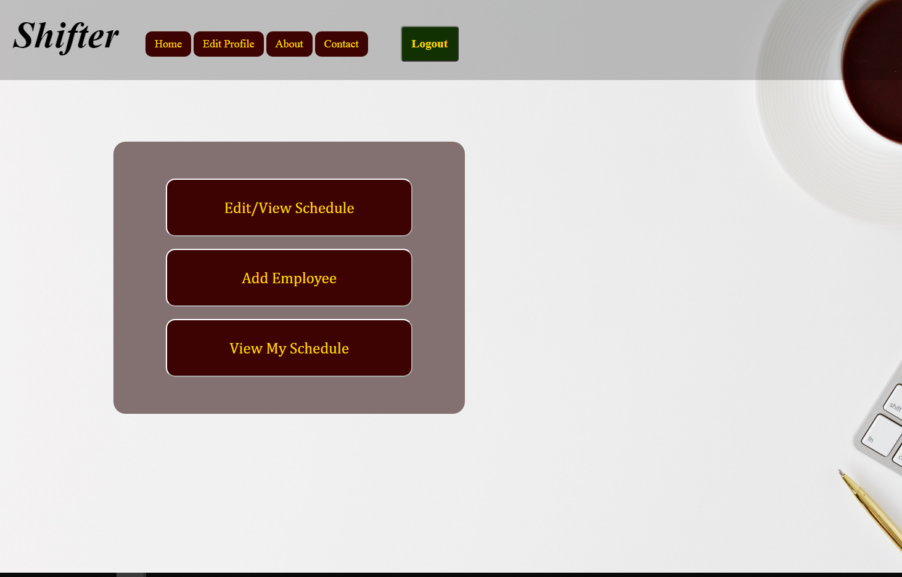
..

 * Manager Edit/View Schedule

.. image:: image/EditViewS.PNG
    :width: 400px
    :align: center
    :height: 400px
    :alt: alternate text
..

 * Adding New Shift

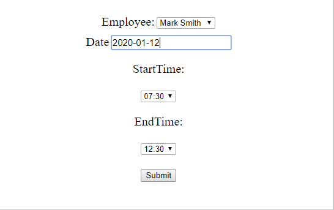
..

 * Add Employee Form

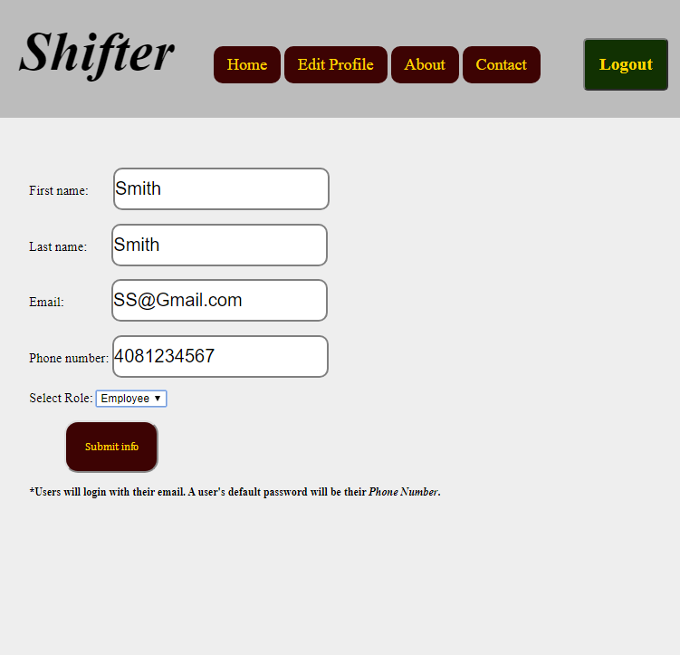
..

 * Add Employee Confirmed

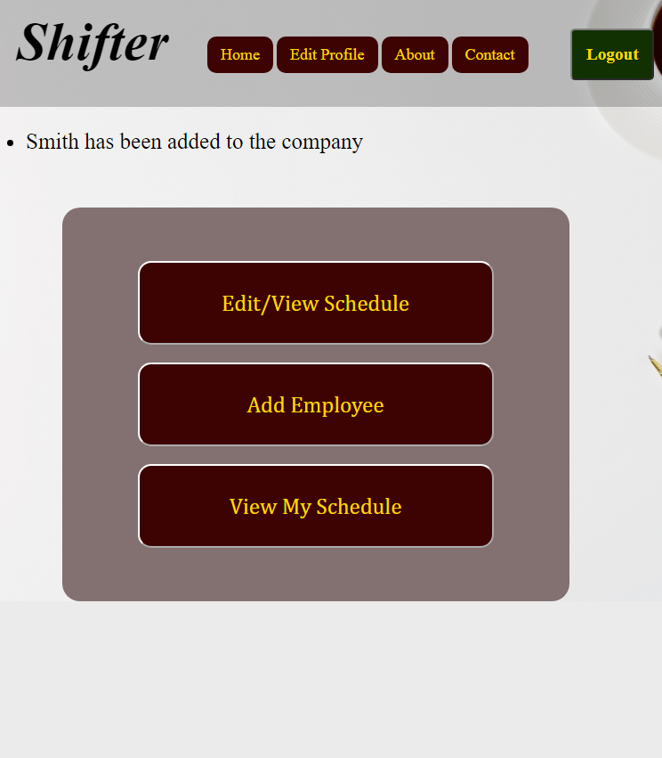
..

 * View my schedule Manager

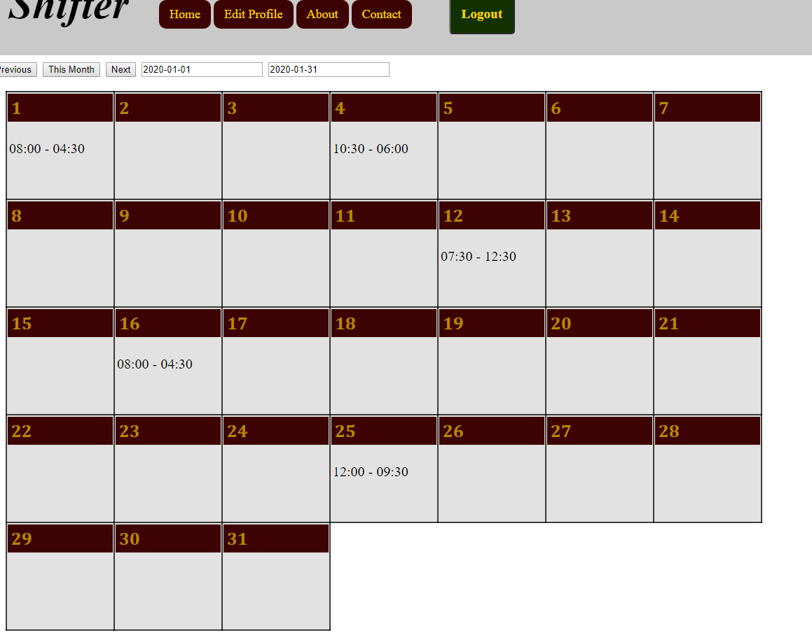
..

 * Logout Confirmation

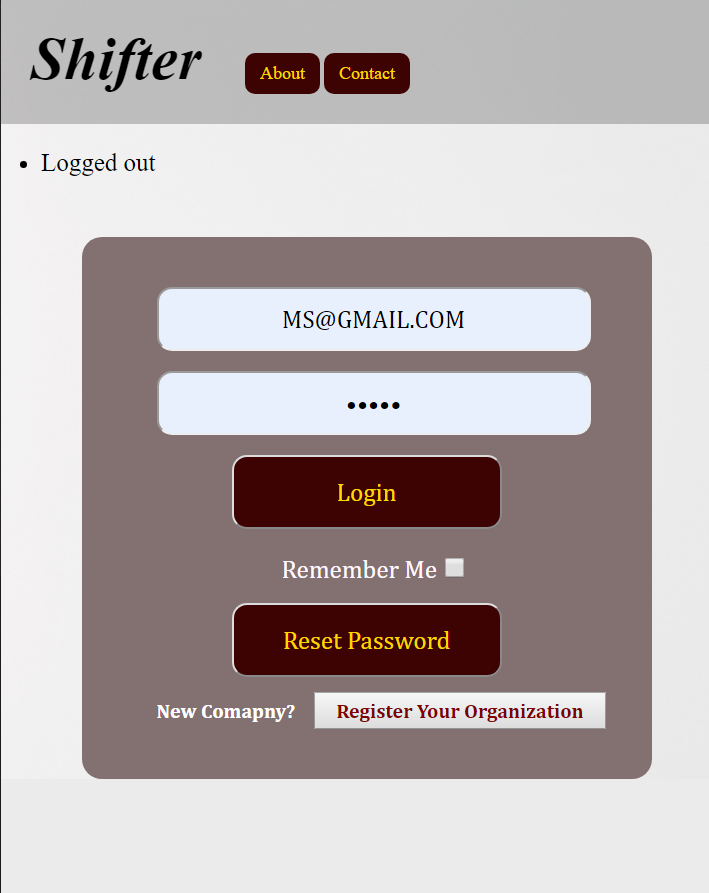
..

 * Employee Loging Mark Mark

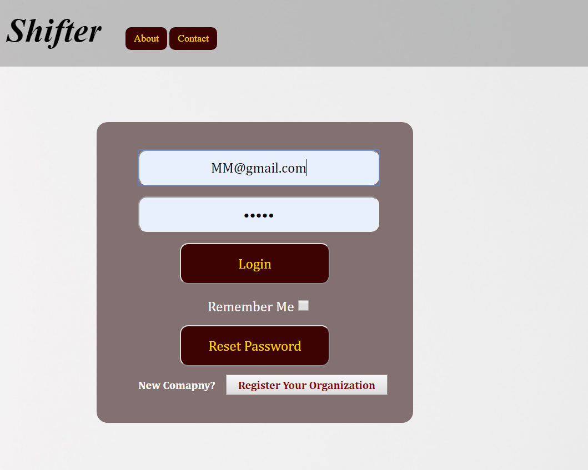
..

 * First time loging Update Password

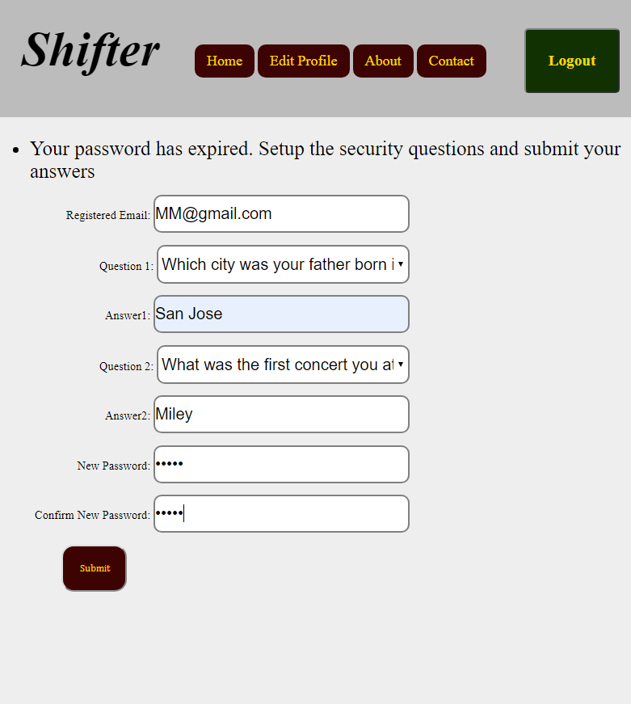
..

 * Password Update Confirmed

.. image:: image/confirmpasswordC.PNG
    :width: 400px
    :align: center
    :height: 400px
    :alt: alternate text
..

 * Employee Homepage

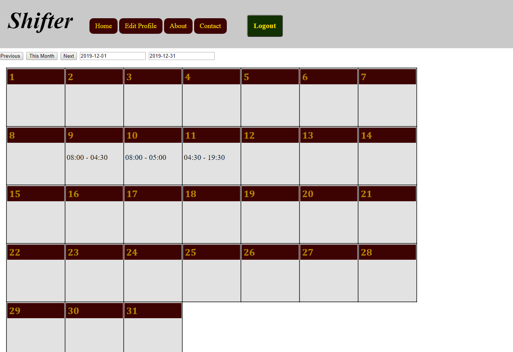
..

 * Employee Edit Profile

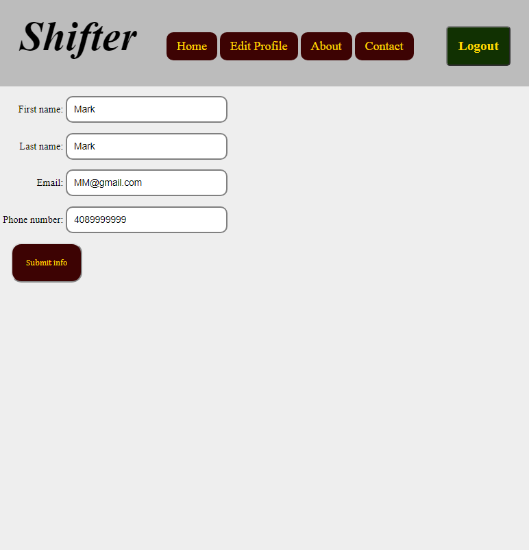
..

